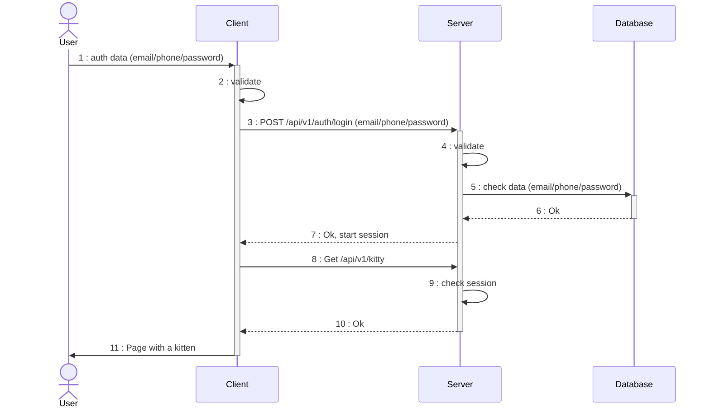

```mermaid
sequenceDiagram
    actor U as User
    participant C as Client
    participant S as Server
    participant Db as Database
    U->>+C: 1 : auth data (email/phone/password)
    C->>C: 2 : validate
    C->>+S: 3 : POST /api/v1/auth/login (email/phone/password)
    S->>S: 4 : validate
    S->>+Db: 5 : check data (email/phone/password)
    Db-->>-S: 6 : Ok
    S-->>C: 7 : Ok, start session
    C->>S: 8 : Get /api/v1/kitty
    S->>S: 9 : check session
    S-->>-C: 10 : Ok
    C->>-U: 11 : Page with a kitten
```
