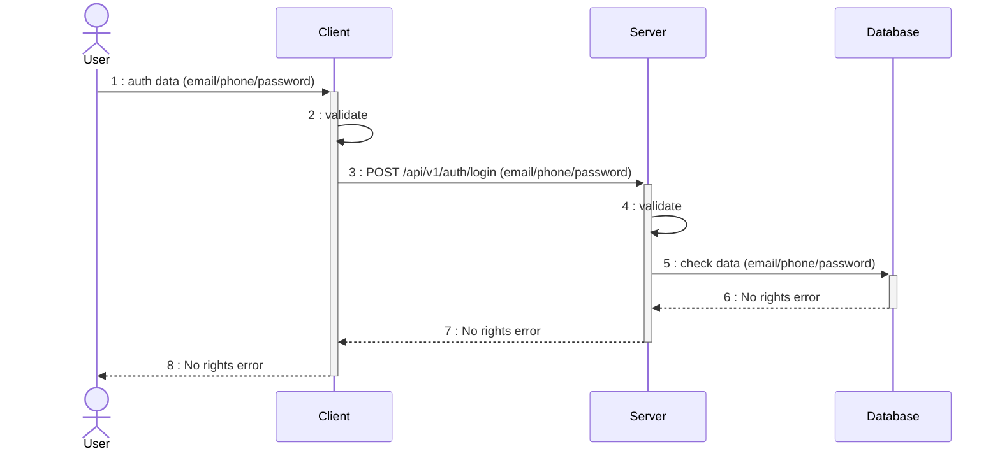

```mermaid
sequenceDiagram
    actor U as User
    participant C as Client
    participant S as Server
    participant Db as Database
    U->>+C: 1 : auth data (email/phone/password)
    C->>C: 2 : validate
    C->>+S: 3 : POST /api/v1/auth/login (email/phone/password)
    S->>S: 4 : validate
    S->>+Db: 5 : check data (email/phone/password)
    Db-->>-S: 6 : No rights error
    S-->>-C: 7 : No rights error
    C-->>-U: 8 : No rights error
```
