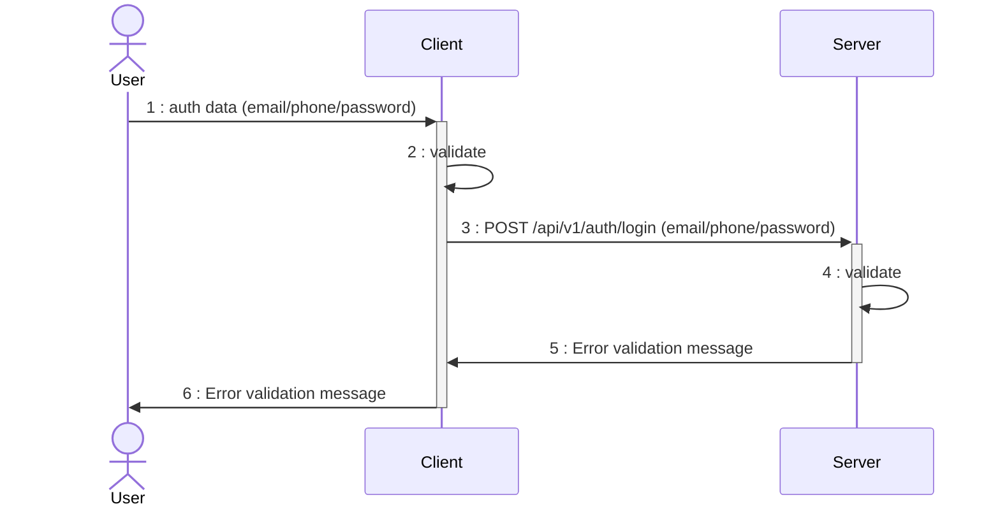

```mermaid
sequenceDiagram
    actor U as User
    participant C as Client
    participant S as Server
    U->>+C: 1 : auth data (email/phone/password)
    C->>C: 2 : validate
    C->>+S: 3 : POST /api/v1/auth/login (email/phone/password)
    S->>S: 4 : validate
    S->>-C: 5 : Error validation message
    C->>-U: 6 : Error validation message
```
